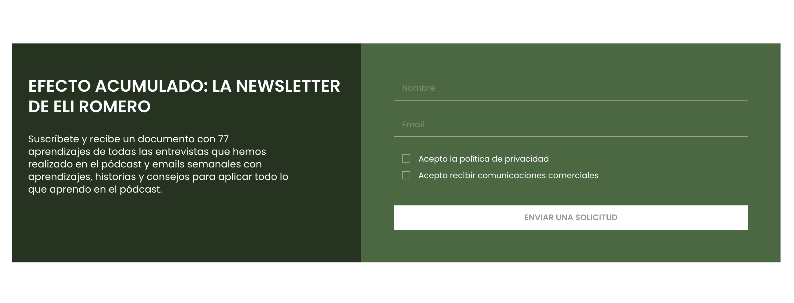

# Tiene Sentido Podcast Landing Page

A modern and responsive landing page built for the **Tiene Sentido Podcast** project.

## Live Demo

https://podcast-website-2v4.pages.dev/

---

## Overview

This project is a responsive landing page developed for the **Tiene Sentido Podcast**. The website was built with a focus on performance, accessibility, SEO optimization, and responsive user experience across all devices.

---

## Technologies Used

* React
* TypeScript
* Tailwind CSS
* Vite
* React Hook Form
* Cloudflare Pages

---

## Features

* Fully responsive design
* Reusable UI components
* Custom page preloader
* Form validation with React Hook Form
* SEO optimization
* Open Graph and Twitter Cards support
* Cloudflare Pages deployment

---

## Development Approach

During development, custom AI skills were used to accelerate implementation and maintain consistency across the project:

* **React Component Skill** — generation of reusable React components
* **Button Creator Skill** — creation of configurable button components
* **Form Validation Skill** — implementation of form validation and error handling
* **Preloader Skill** — implementation of the page preloader
* **Style Guide Skill** — maintaining consistent UI patterns and styling

---

## Key Responsibilities

* Built the landing page from scratch
* Developed reusable React components
* Implemented responsive layouts
* Added form validation and error handling
* Optimized images and page performance
* Configured SEO metadata and social sharing tags
* Implemented custom preloader
* Deployed the project using Cloudflare Pages

---

## Screenshots

### Hero Section (Desktop)


---

### Hero Section (Mobile)


---
### Menu (Mobile)


---

### Newsletter Form

<!-- Insert newsletter form screenshot here -->



---

### Full Landing Page

<!-- Insert full-page screenshot here -->


---


## Installation

```bash
npm install
npm run dev
```

## Production Build

```bash
npm run build
```

## Deployment

The application is deployed using Cloudflare Pages with automated GitHub integration.

## Author

Tetiana Hrytsenko


